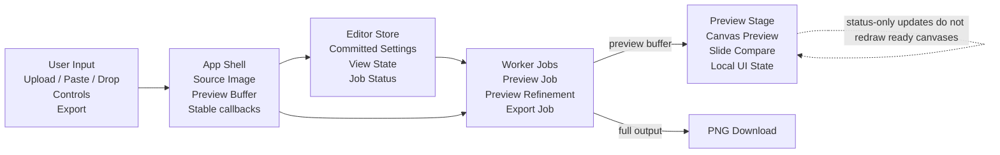

# IMDITHER

IMDITHER is a local-first web workstation for turning images into deterministic
dithered PNG output. Images are decoded, processed, previewed, and exported in
the browser; the app does not upload source images to a server.

## What It Does

- Load images by upload, drag and drop, clipboard paste, or the bundled demo
  image.
- Process images in a Web Worker so the editor can keep responding while
  settings change.
- Preview with a reduced working buffer for interaction, then export the full
  selected output as PNG.
- Compare original and processed output with a slide before/after preview,
  processed-only view, or original-only view.
- Use Fit and 1:1 preview modes on desktop; mobile keeps the preview in Fit mode.
- Export the current result as a PNG file.
- Copy and paste versioned settings JSON through the system clipboard.
- Switch between persistent dark and light themes from the header.

## Processing Controls

- Algorithms: None, Bayer, Matt Parker, Floyd-Steinberg, and Atkinson.
- Bayer matrix sizes: 2x2, 4x4, and 8x8.
- Preset palettes: Black / White, 4 Gray, Game Boy, Amber Terminal, CGA Pop,
  Redline, and Sea Glass.
- Color modes: grayscale-first and color-preserve.
- Preprocessing: brightness, contrast, gamma, invert, and alpha flattening
  against black or white.
- Resize settings: aspect-aware output width and height, contain / cover /
  stretch fitting, and bilinear or nearest-neighbor resizing.

## Current Stack

- Bun
- Vite 7
- React 19
- React Compiler
- Zustand
- Vitest
- Tailwind CSS 4
- shadcn/ui primitives in `packages/ui`
- DOM-free dithering engine in `packages/core`

## Workspace

- `apps/web` - Vite React app and editor UI.
- `packages/core` - deterministic image processing, palettes, settings schema,
  and tests.
- `packages/ui` - shared shadcn/ui primitive layer.
- `docs/` - Product Requirements Documents (PRDs), architecture, etc.

## Architecture



## Development

Install dependencies:

```sh
bun install
```

Run the app locally:

```sh
bun dev
```

Run the standard checks:

```sh
bun typecheck
bun lint
bun test
bun build
```

The root scripts are Turbo-powered and run the matching script in each
workspace package.

## CI And Release

GitHub Actions run typecheck, lint, tests, and build. Vercel publishing is kept
as a manual workflow and is gated on a successful CI run for the same commit.
