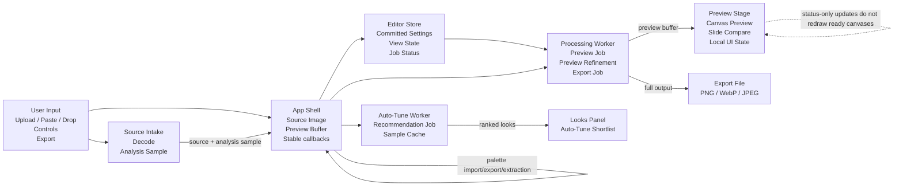

# IMDITHER

IMDITHER is a local-first web workstation for turning images into deterministic
dithered raster output. Images are decoded, processed, previewed, and exported
in the browser; the app does not upload source images to a server.

## What It Does

- Load images by upload, drag and drop, clipboard paste, or the bundled demo
  image.
- Process images in a Web Worker so the editor can keep responding while
  settings change.
- Preview with a reduced working buffer for interaction, then export the full
  selected output.
- Generate Auto-Tune recommendations in a separate worker after the first
  preview is ready.
- Compare original and processed output with a slide before/after preview,
  processed-only view, or original-only view.
- Use Fit or Real Pixels preview with mouse, wheel, and touch zoom/pan; desktop
  also exposes pixel inspection.
- Review generated Auto-Tune looks after each source load and apply one as a
  normal editable look.
- Export the current result as PNG, WebP, or JPEG.
- Create, edit, import, export, and extract one active custom palette.
- Copy and paste versioned settings JSON through the system clipboard.
- Copy, paste, and URL-apply shareable Look payloads without sharing source
  image data.
- Switch between persistent dark and light themes from the header.

## Processing Controls

- Algorithms: None, Bayer, Matt Parker, Floyd-Steinberg, Atkinson, Burkes,
  Stucki, Sierra Lite, Blue Noise, and Halftone Dot.
- Bayer matrix sizes: 2x2, 4x4, and 8x8.
- Palettes: Black / White, 4 Gray, 6 Gray, Warm Mono, Blue Ink,
  Game Boy, DawnBringer 16, DawnBringer 32, Sweetie 16, AAP-16, Endesga 32,
  PICO-8, C64, EGA 16, Amber Terminal, Green Phosphor, Thermal, CGA Pop,
  Soft 8, Poster 12, Risograph, Redline, Screenprint 16, Sea Glass, and one
  active Custom palette.
- Custom palette workflow: convert the current preset palette, edit swatches,
  import HEX/GPL/JSON or clipboard text, export JSON/GPL, and extract 2, 4, 8,
  16, or 32 colors from the current source image.
- Color modes: grayscale-first and color-preserve.
- Preprocessing: brightness, contrast, gamma, invert, and alpha flattening
  against black or white.
- Resize settings: aspect-aware output width and height, contain / cover /
  stretch fitting, and bilinear or nearest-neighbor resizing.

## Current Stack

- Bun
- Vite 7
- React 19
- React Compiler
- Zustand
- Vitest
- Tailwind CSS 4
- shadcn/ui primitives in `packages/ui`
- DOM-free dithering engine in `packages/core`

## Workspace

- `apps/web` - Vite React app and editor UI.
- `packages/core` - deterministic image processing, palettes, settings schema,
  and tests.
- `packages/ui` - shared shadcn/ui primitive layer.
- `docs/` - Product Requirements Documents (PRDs), architecture, etc.

## Public Contracts

- [Product PRD](docs/PRD.md) - current product behavior and architecture.
- [Editor Settings Schema](docs/settings-schema.md) - versioned Settings JSON
  contract for clipboard copy/paste and Look Snapshot sharing boundaries.
- [MIT License](LICENSE) - usage and contribution licensing.

## Architecture



## Development

Install dependencies:

```sh
bun install
```

Run the app locally:

```sh
bun dev
```

Format files:

```sh
bun format
```

Run the standard verification after changes:

```sh
bun verify
```

Run individual checks:

```sh
bun format:check
bun typecheck
bun lint
bun test
bun build
```

The root scripts are Turbo-powered and run the matching script in each
workspace package.

Run the non-gating performance baseline report:

```sh
bun run --cwd packages/core perf:baseline
```

## CI And Release

GitHub Actions run typecheck, lint, tests, and build. Vercel publishing is kept
as a manual workflow and is gated on a successful CI run for the same commit.
